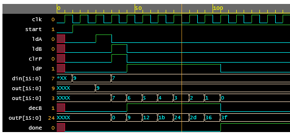

# Multiplication_by_repetitive_addition
This program performs multiplication of two 16-bit numbers.

The program is written using <b>Verilog HDL</b> and it uses the repetitive addition method for multiplication of two numbers.

The program has two separate blocks, one is the <b>DATAPATH</b> and other is <b>CONTROLLER</b> block.

A DATAPATH consists of various inter-connected functional blocks like shift registers, adders, ALUs, etc., where as CONTROLLER block generates control or the logic signals to the functional blocks.

The functional blocks used in this program are:

1. Two 16-bit PIPO registers with load and clear functions.
2. A 16-bit adder.
3. A 16-bit decrement counter.
4. A 16-bit comparator.

The operation starts with a `start` signal where the registers A and P are cleared and the hardware is initialized. Next the register A and counter B is loaded through a common data bus at different time instances. 

The 16-bit register P is added with content of register P and register A and the output value is stored back in P and the counter B is decremented. This process is done until the value of counter B becomes zero.

At the end `done` signal is generated and the final result is stored in register P.

<h3> Timing Diagram </h3>

<b>To load the program in EDA Playground [click here](https://www.edaplayground.com/x/drS7).</b>
